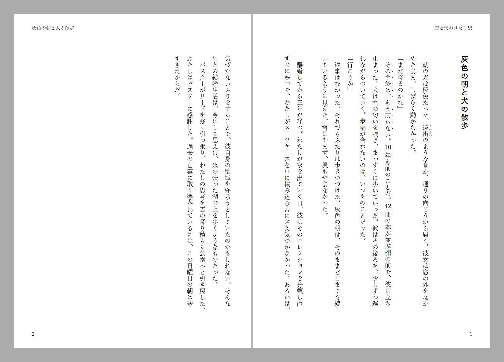

# Vivlio

**English** | [日本語](README.ja.md)

Typeset Obsidian notes with [Vivliostyle](https://vivliostyle.org/) — CSS paged
media, Japanese vertical writing, ruby and emphasis dots — with a live preview,
and export to PDF and EPUB.

Desktop only (`isDesktopOnly: true`). Nothing is downloaded on first run: the
typesetting engine ships in the plugin and the PDF is printed by the Chromium
Obsidian already runs.

Implements [docs/SPEC.md](docs/SPEC.md).


*The note on the left, the page on the right. The preview uses the same engine
and the same stylesheet the PDF will.*

One thing the preview cannot do on its own: the page numbers on a contents
page read `??` until every page has been laid out, because the number comes
from `target-counter`, which has nothing to count against a page that has not
been composed yet. An export always composes the whole book, so the PDF and
the EPUB are correct. To see the real numbers on screen, turn on **Render
every page up front** in the settings — the preview then takes longer to
appear and is right from the first frame.

## What it does

| | |
|---|---|
| **Preview** | A pane showing the real page composition — the same engine and stylesheet the PDF will use. Vertical writing, hanging punctuation and Japanese/Latin spacing included, none of which Obsidian's own PDF export can produce. |
| **Books, not just notes** | A single note, a whole folder, or the `[[links]]` of a table-of-contents note, in that order. |
| **Obsidian syntax** | Embeds, wikilinks, callouts, task lists, tags, highlights, plus Aozora/Kakuyomu ruby, emphasis dots and tate-chu-yoko. |
| **PDF** | Tagged, searchable, with bookmarks, metadata and `i, ii, iii, 1, 2 …` page labels. Fonts are embedded and subset by Chromium, so the file is printable elsewhere. |
| **EPUB 3** | Reflowable, with the theme's CSS, a cover and landmarks. |
| **Pre-export checks** | Images that will print below 300 dpi, fonts this machine does not have, a cover whose aspect ratio does not match the page. |

## Installing

**From Obsidian.** Settings → Community plugins → Browse, search for *Vivlio*,
install and enable it.

**By hand.** Take `main.js`, `manifest.json` and `styles.css` from a
[release](https://github.com/nonkuri/obsidian-vivlio/releases) and drop them
into `VaultFolder/.obsidian/plugins/vivlio/`, then reload Obsidian and enable
the plugin under Community plugins.

Desktop Obsidian 1.7.0 or later. The plugin prints through the Chromium that
Obsidian is already running, which is why there is no mobile build.

## Opening the preview

Three ways in, whichever is nearest to hand:

- **The ribbon.** The book icon in the left ribbon typesets the note you are
  looking at.
- **The command palette.** `Vivlio: Open preview` does the same.
- **The file explorer's context menu.** Right-click a Markdown note for
  **Vivlio: preview**. Right-click a *folder* for **Vivlio: preview as a
  book** — every `.md` in it, in chapter order — and **Vivlio: export as a
  book** beside it.

The pane opens on the right, with a toolbar across the top: **Rebuild**, a
theme picker, and **PDF** and **EPUB** buttons that open the export dialog for
whatever the pane is showing. It re-typesets as you edit the note; turn that
off with **Refresh the preview automatically** in the settings, and rebuild by
hand with the toolbar button or `Vivlio: Reload typeset result`.

## Commands

| Command | What it does |
|---|---|
| `Vivlio: Open preview` | Typeset the active note in a side pane |
| `Vivlio: Export to PDF` / `to EPUB` | Export dialog, checks, then the file |
| `Vivlio: Export this folder as a book` | Every `.md` in the folder, in order |
| `Vivlio: Build a book from this note's links` | The note's `[[links]]` become the spine |
| `Vivlio: Create book configuration` | Wizard that writes `vivlio.yaml` |
| `Vivlio: Add configuration to this note` | Inserts flat `vivlio-*` frontmatter |
| `Vivlio: Write configuration reference` | Every key, with defaults and comments |

The file explorer's context menu offers preview and export as well — see
[Opening the preview](#opening-the-preview).

## Configuring a book

Three layers; a lower one overrides the one above it.

1. **Settings tab** — vault-wide defaults.
2. **`vivlio.yaml`** next to the book — the real place for a book's settings.
   Nesting and comments allowed.
3. **A note's frontmatter** — flat `vivlio-*` keys only, so Obsidian's property
   editor can edit them (it cannot edit nested YAML).

```yaml
# vivlio.yaml
title: 吾輩は猫である
author: 夏目漱石

theme: novel              # novel, or a CSS path in the vault — see “A theme of your own”
writingMode: vertical-rl
size: 文庫
charsPerLine: 39
linesPerPage: 15
footnote: gcpm            # bottom of the page

cover: 装丁/表紙.png
sections:
  titlePage: auto
  toc: auto
  preface: まえがき.md
  colophon: auto
pageNumbering: roman-then-arabic
startPage: 1             # the number the body starts counting from
output: 原稿/出力/猫.pdf
```

```yaml
---
title: 吾輩は猫である
vivlio-theme: bunko
vivlio-size: 文庫
---
```

A note's own `title` is read as well, so a single note exported on its own
needs no `vivlio-title` to name the book. Write `vivlio-title` when the two
should differ — it wins — which is the form `Vivlio: Add configuration to this
note` inserts, since every key it offers takes the `vivlio-` prefix.

Run `Vivlio: Write configuration reference` for a `vivlio.yaml` listing every
key with its default and a comment.

## Chapter order

1. A table-of-contents note (`index.md`, a note named after the folder, or one
   with `vivlio-toc: true`) — its `[[links]]` in the order they appear.
2. Otherwise the natural order of file names, so `2.md` comes before `10.md`.
3. `vivlio-order: 3` pins a note to a position either way.

The table-of-contents note itself stays out of the book unless
`includeToc: true`.

`vivlio-order` and `vivlio-toc` belong to a note rather than to the book, so
`vivlio.yaml` has no use for them and the configuration reference leaves them
out. `Vivlio: Add configuration to this note` offers both.

## Notation

| You write | You get |
|---|---|
| `《《テキスト》》` | emphasis dots (Kakuyomu style) |
| `漢字《かんじ》` | ruby over the run of kanji in front of it — the shorthand a manuscript actually uses |
| `｜任意《よみ》` | ruby over anything; `｜` says where the base begins (a halfwidth `\|` does too) |
| `{漢字\|かんじ}` | ruby (VFM's own syntax) |
| `^^1/2^^` | tate-chu-yoko, up to four characters |
| a one- or two-digit number, in vertical writing | set upright automatically — a pair combined into one em, a lone digit stood up rather than laid on its side. Only when no digit, letter or `. , : % -` adjoins it |
| `==highlight==` | emphasis dots, bold, `<mark>` or plain text — your choice |
| `［＃改ページ］` | a forced page break, written the way Aozora Bunko writes one |
| three or more blank lines | space on the page: `n` blank lines give `n - 2` blank lines of it |
| an ideographic space starting a line | that paragraph is indented, and the character itself goes |
| `> [!anything]` | a framed callout. Any type; it survives as `callout-<type>` for a theme to style |
| `![[fig.png\|300]]` | a picture at a stated width — `300`, `300x200`, `60%`, `80mm`, `300px` |
| `` | a `<figure>` with the caption under it. The wiki form takes a width, this one a caption |
| `![[Note]]`, `![[Note#Heading]]` | the note's text, set in place (three deep; a cycle is refused) |
| `[[Note]]`, `[[Note\|shown]]` | a link when the note is in the book, plain text when it is not |
| `- [ ]` | ☐ / ☑, drawn as text rather than as a form control |
| a `mermaid` or `dataview` block | drawn by Obsidian's own renderer, then placed as a figure |
| `#tag`, `%%comment%%`, `^block-id` | removed |

Every stage can be switched off in the settings tab, and none of them can reach
inside a code block: the conversions run over the document tree, not over the
Markdown source.



## A theme of your own

`theme:` also takes the vault-relative path of a stylesheet, and that stylesheet
can start from a bundled one:

```css
/* 装丁/私の本.css */
@import url("vivlio:novel");

:root {
  --vs-novel--chars-per-line: 42;
  --vs-novel--lines-per-page: 17;
  --vs-novel--boten-font-size: 0.32rem;
  --vs-novel--secondary-ink: #4a4a4a;
}

.callout-warning { border-color: #b00; }
```

```yaml
# vivlio.yaml
theme: 装丁/私の本.css
```

`vivlio:novel` is the theme this plugin is built around and the one its page
geometry is tuned against. `vivlio:base`, `vivlio:bunko`, `vivlio:techbook` and
`vivlio:academic` — the CC0 Vivliostyle themes — resolve too, but only `novel`
is offered in the picker: the others have not been gone over against this
plugin's folios and headings yet.

Any other `@import` is an ordinary one, relative to the file doing the
importing and read from the vault. Each is followed once, so a ring of imports
is safe. The whole thing is flattened into a single stylesheet before use, which
is why the preview and the EPUB read exactly the same text.

The classes worth knowing when writing one: `.boten`, `.tcy`, `.callout` and
`.callout-<type>`, `.task-list`, `.vivlio-page-break`, `.vivlio-blank-lines`,
`.vivlio-no-indent`, `.vivlio-rendered`.

## Building

```bash
npm install
npm run build
```

`main.js`, `manifest.json` and `styles.css` are what a release ships. The
prebuilt Vivliostyle viewer and the four CC0 themes are embedded in the bundle,
so there is nothing else to copy.

```bash
npm test
```

The tests run the real conversion pipeline, the configuration layers and the
local server outside Obsidian, against a small stub of the app's API.

## Releasing

`npm version patch` (or `minor` / `major`) writes the new number into
`package.json`, `manifest.json` and `versions.json` in one go. Pushing the tag
it creates is the whole release: the workflow builds the bundle, checks that
the tag and the manifest agree, and uploads the three files as loose assets —
which is the shape Obsidian's installer expects.

```bash
npm version patch
git push --follow-tags
```

## How it works

```
note(s) ──▶ VFM (+ this plugin's hooks) ──▶ HTML + generated CSS
                                                │
                                    127.0.0.1 (token-scoped)
                                                │
                            ┌───────────────────┴───────────────────┐
                            ▼                                       ▼
                   iframe + Vivliostyle viewer          hidden webview → printToPDF
                          (preview)                       → pdf-lib (bookmarks,
                                                             metadata, page labels)
```

Vivliostyle fetches the document and its assets over XHR, which rules out
`file://`, so the plugin serves the build over loopback while a preview or an
export is open. That server binds `127.0.0.1` only, requires a per-session
token in every URL, checks the `Host` header, answers only GET and HEAD, sends
no CORS headers, and refuses any path outside the vault unless a font was
explicitly configured from elsewhere.

## Licence

AGPL-3.0-or-later. `@vivliostyle/core` and `@vivliostyle/viewer` are AGPL-3.0
and are bundled into `main.js`, so the plugin as a whole is AGPL-3.0. See
[LICENSE](LICENSE) and [NOTICE](NOTICE) — VFM is Apache-2.0 and the themes are
CC0-1.0.

Fonts are never bundled. Checking that a font's licence allows embedding it in
a PDF or an EPUB is up to you.
