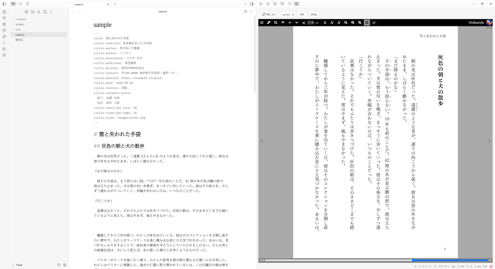

# Vivlio プラグインの概要

[マニュアル目次](00_vivlio_plugin_manual.md) / [次: まずは一冊作ってみる](02-first-book.md)

## Vivlio とは

Vivlio は、Obsidian の Markdown ノートを [Vivliostyle](https://vivliostyle.org/ja/) で組版するデスクトップ版 Obsidian 専用のプラグインです。外部アプリを使わずObsidianのノートをそのまま原稿にして組版し、EPUB または PDF を作成します。PDFの仕上がりはサイドペインでプレビュー可能です。

組版エンジンと Viewer はプラグインに同梱されています。外部のブラウザや組版エンジンをダウンロードする必要はありません。PDF は Obsidian が使用している Chromium で生成されます。

## 主な機能

### 生成 PDF のライブプレビュー

プレビューは PDF と同じ Vivliostyle エンジンとスタイルシートを使います。縦書き、ルビ、傍点、縦中横、柱、ノンブル、ページ分割など、通常の Markdown プレビューでは確認できない紙面を見ながら調整できます。

なお、目次内のページ番号だけは例外です。すべてのページを組版しないとページ番号が確定しないため、未描画のページがある間は `??` になることがあります。設定の **全ページを最初に描画する** をオンにすれば最初から確定しますが、表示は遅くなります。PDF / EPUB の書き出し時は常に全体を組むため、出力には影響ありません。

### 単独ノートでの作成はもちろん複数ノートをまとめることも可能

組版の仕方は三種類です。

| 対象 | 動作 |
|---|---|
| ノート | 開いている 1 ノートを 1 冊として組版 |
| フォルダ | 直下の `.md` を章として 1 冊にまとめる。サブフォルダは対象外。 |
| 目次ノート | 目次ノート内の `[[ウィキリンク]]` の順に章を並べる |

フォルダ本の章順は、目次ノートがあればその `[[リンク]]` の順、なければファイル名の自然順です。`vivlio-order` を持つノートは、それらより優先して指定の位置へ挿入されます。詳しくは [原稿の書き方と本の組み立て方](05-writing-and-structure.md) を参照してください。

### 使用可能な記法

次の記法を扱えます。

- ノート・画像の埋め込み、ウィキリンク
- コールアウト、タスクリスト、ハイライト
- Mermaid、Dataview などの描画結果
- 青空文庫・カクヨム系のルビ、傍点、改ページ
- 縦中横、縦書き内の短い半角数字の自動正立
- 原稿の全角スペースを手掛かりにした段落字下げ
- 連続空行を紙面上の空きに変換

コードブロックの中は変換しません。各処理は設定で個別にオン / オフできます。

### PDF と EPUB 3 を作れる

**PDF** は検索可能なテキストを保ち、任意でタグ、しおり、メタデータ、ページラベル、表紙を付けられます。フォントは Chromium が PDF に埋め込み、通常は使用文字だけにサブセット化します。

**EPUB 3** はリフロー型です。読書端末が画面サイズや文字サイズに応じて再レイアウトするため、PDF とまったく同じ改ページにはなりません。テーマ CSS、表紙、ナビゲーション、ランドマークを収録します。

## 設定の考え方

Vivlio の設定は三層です。下ほど優先されます。

1. **プラグイン設定** — Vault 全体の既定値
2. **`vivlio.yaml`** — その本だけの設定
3. **ノートの `vivlio-*` フロントマター** — そのノートで上書き

本全体に関する指定は `vivlio.yaml` に集めるのが基本です。フロントマターは、特定ノートだけの例外や `vivlio-order`、`vivlio-toc` のようなノート固有情報に使います。

## テーマ

既定の `novel` は Vivlio 用に調整した縦組み小説テーマです。Vault 内の任意の `.css` をテーマにでき、`@import url("vivlio:novel");` から少しずつ変更できます。

プラグインには Vivliostyle の `base`、`bunko`、`techbook`、`academic` も同梱されていますが、テーマ選択欄に標準表示されるのは動作確認済みの `novel` だけです。ほかの同梱テーマは自作 CSS から `vivlio:base` などとして読み込めます。

詳しくは [自分でテーマを作ってみる](06-custom-theme.md) を参照してください。

## 動作条件と注意点

- デスクトップ版 Obsidian 1.8.7 以降が必要です。
- モバイル版では動作しません。
- プレビュー中と書き出し中だけ、`127.0.0.1` のローカル HTTP サーバを起動します。
- 外部画像の取得、Vault 外ファイル、動的スクリプトの実行は設定で制御できます。
- `dataviewjs` や Templater はノート内の JavaScript を実行します。信頼できないノートでは **dataviewjs / templater を実行する** をオフにしてください。
- EPUB はリーダーごとの差があるため、最終確認は実際に配布先で使う EPUB リーダーでも行ってください。

## コマンド一覧

| コマンド | 動作 |
|---|---|
| **Vivlio: プレビューを開く** | アクティブノートを右サイドペインで組版 |
| **Vivlio: PDF に書き出す** | アクティブノートの PDF 書き出しダイアログを開く |
| **Vivlio: EPUB に書き出す** | アクティブノートの EPUB 書き出しダイアログを開く |
| **Vivlio: このフォルダを本として書き出す** | アクティブノートの親フォルダを一冊の PDF として書き出す |
| **Vivlio: このノートを目次として本を組む** | ノート内の `[[リンク]]` 順で章を集め、PDF 書き出しダイアログを開く |
| **Vivlio: 組版結果を再読み込み** | 開いている Vivlio プレビューを再ビルド |
| **Vivlio: 本の設定を作成** | アクティブノートのフォルダに `vivlio.yaml` を作るウィザード |
| **Vivlio: このノートに設定を追加** | 選んだ `vivlio-*` キーをフロントマターへ追加 |
| **Vivlio: 設定リファレンスを書き出す** | `vivlio-reference.yaml` を現在のフォルダへ生成 |
| **Vivlio: 現在の設定を vivlio.yaml に書き出す** | Vault の既定から変更された本設定を書き出す |
| **Vivlio: この vivlio.yaml を Vault の既定にする** | 現在のフォルダの本設定から一部をプラグイン設定へ取り込む |
| **Vivlio: 診断ログを書き出す** | `.obsidian/plugins/vivlio/vivlio.log` へ診断情報を保存 |

ファイルエクスプローラの右クリックメニューでは、Markdown ノートをプレビューできます。フォルダには **本としてプレビュー**と **本として書き出す**が表示されます。

### 書き出し前に問題を点検する

出力前に、主に次の項目を警告します。

- 解決できないリンク、見つからない画像やファイル
- 紙面上の実効解像度が指定値を下回る画像
- この PC で見つからない指定フォント
- `cover` で切り抜かれる表紙画像と用紙の縦横比の差
- EPUB に表紙が指定されていないこと

警告を確認して続行することも、いったん中止して原稿を直すこともできます。
