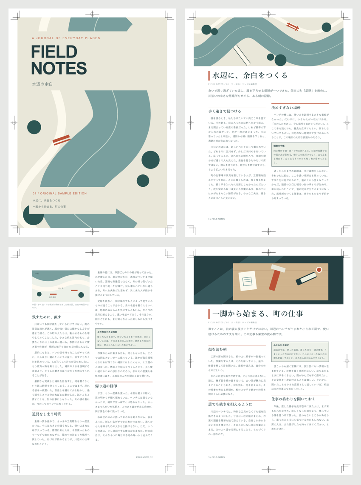

# 横書き印刷用マガジン「FIELD NOTES」

Vivlio **0.17.3** 用の独立CSSと、架空の町を題材にしたMarkdown原稿・SVG図版の配布サンプルです。A4縦・左綴じ・横書き二段組。大きな段抜き見出し、リード、裁ち落とし図版、囲みコラム、小口側のノンブルを試せます。



- [CSS](horizontal-magazine.css)
- [設定](book/vivlio.yaml)
- [原稿1](book/01-river.md) / [原稿2](book/02-workshop.md)
- [組見本PDF](horizontal-magazine.pdf)（トンボ付き・4ページ）

## 使い方

1. ZIPを展開し、`horizontal-magazine` フォルダをそのままVault直下へコピーします。
2. **`horizontal-magazine/book` フォルダを対象に**Vivlioのプレビューを開き、再ビルドします。
3. PDFを書き出します。トンボ・3mm塗り足しは同梱YAMLで指定済みです。

CSSをObsidianの外観設定の「CSSスニペット」に登録する必要はありません。追加テーマやインターネット接続も不要です。フォントは端末の游ゴシック・游明朝などを使います。

`theme` は **Vaultルートからのパス**です。違う場所へ置いた場合はYAMLを変更してください。このリポジトリ全体をVaultにする場合は `sample/css/horizontal-magazine/horizontal-magazine.css` です。`cover` は `book` からの相対パスです。

説明用README・PDF・ライセンスは `book` の外に置いています。`horizontal-magazine` 全体を組版対象にすると説明まで本文に入るため、必ず `book` を指定してください。表紙はYAMLの `cover` で読み込み、本文原稿には含めません。表紙はノンブルに数えず、本文は1から始まります。

## 原稿の約束

各記事を独立したMarkdownファイルにします。ファイル名順に、新しいページから始まります。冒頭は次の順です。

```markdown


# 記事の見出し

FIELD NOTES / 01　文・図版：サンプル編集室

ここに記事のリードを書きます。見出し・著者行・リードは二段幅です。

## 本文の節見出し

ここから本文です。

> [!note] 囲みの見出し
> コラムの本文です。
```

冒頭画像は上端の裁ち落とし画像として扱い、キャプションを非表示にします。画像の代替テキストは保持します。冒頭画像を削除すれば、見出しから始まる記事にも使えます。`#` の後の二つの段落は著者行とリードなので、省略する際はCSSも変更してください。

本文途中のMarkdown画像は一段幅・縦横比を保持し、代替テキストをキャプションにも使います。段やページの残りに入らない場合は次へ送ります。画像にタイトル文字を焼き込まず、説明をMarkdownに書くと差し替えやすくなります。

## 塗り足しの設計

仕上がりは **210 × 297mm**、塗り足しは各辺 **3mm** です。CSSの `@page` がYAML由来の `marks` と `bleed` を受け取り、画像自身も裁断線の外へ延ばします。トンボを付けただけで画像の外側が白い、という状態にはしていません。

| 図版 | 配置寸法 | 塗り足し |
|---|---|---|
| 表紙 `cover.svg` | 216 × 303mm | 上下左右3mm。表紙画像の配置はプラグイン標準機能 |
| 記事冒頭 `river.svg` / `workshop.svg` | 216 × 70mm | 上・左・右の3辺が裁ち落とし。下端は紙面内 |
| 本文図 `plan.svg` | 段幅に縮小 | 紙面内に収めるため不要 |

表紙SVGの座標系は216 × 303、裁断位置は左上の(3, 3)から(213, 300)です。文字は十分内側に置き、外周にも地色・図柄があります。SVGは外部画像・フォントファイルを参照せず、拡大で画素が粗くならないベクター図版です。

写真へ差し替える場合は、端まで絵柄のある素材を用意し、重要な顔や文字を裁断線から最低5mm程度内側へ置いてください。これは本サンプルの安全域の目安であり、最終的には印刷所の指定に合わせます。表紙を300ppiで用意するなら約2552 × 3579px、冒頭図版は約2552 × 827pxです。`object-fit: cover` により縦横比が異なる画像は中央基準で切り抜かれます。画像自体の周囲に白い枠を付けないでください。

`cropMarks: false` のまま `bleed: 3mm` を残すと、プラグインは216 × 303mmの紙面にします。裁断位置を示すトンボはありません。**A4仕上がりの閲覧PDF**が欲しい場合は `cropMarks: false` と `bleed: ""` の両方を指定します。トンボなしでは本文の版面も変わるため、同じ改ページを保証しません。

用紙サイズ・ページ余白を変える場合は、冒頭図版の幅・負のマージンも一緒に見直してください。このCSSは18mmの左右・上余白を前提にしています。長すぎる見出しやリードは本文を次ページへ押し出すため、差し替え後にプレビューで確認してください。

## 著作権と再配布

詳細は [素材の来歴](SOURCES.md) と同梱 [LICENSE](LICENSE) を参照してください。CSS・本文・SVGはこのサンプル用に新規作成し、リポジトリと同じ **AGPL-3.0-or-later** で提供します。改変・再配布時にはライセンスと来歴、編集できる元ファイルを一緒に保持してください。第三者の本文・写真・ロゴ・フォントファイルは同梱していません。

配布ZIPはリポジトリの `sample/downloads/` に置き、サンプル一覧から案内します。プラグインのRelease資産には追加しません。

## 確認範囲とプラグインの修正要否

**この作例を組むためのプラグイン修正は不要です。** プラグイン本体のソースは変更していません。

Vivlio 0.17.3の `buildBook` と同梱Viewer、Windows上のChromeを使い、実際のMarkdown・YAML・CSS・画像から4ページを出力しました。Obsidian APIのみテスト用代替です。トンボあり／なしの3mm塗り足しで、画像読み込み・本文の全段落・段抜き見出し・画像幅216mm・塗り足し外縁への到達を検証しています。トンボ付きPDFは全ページをPNG化して目視確認しました。フォント環境で改ページは変わります。

組見本は組版確認用です。**PDF/X・CMYK変換・明示的なTrimBox/BleedBoxの付与は行っていません。** Chromiumの出力ではトンボを含むMediaBoxが紙面全体になり、独立したTrimBox/BleedBoxはありません。プラグインのPDF後処理にもこれらの付与処理はありません。印刷所がこうしたPDF仕様を必須にしている場合は、別のプリプレス工程、またはプラグインのPDF出力拡張が必要です。

Obsidianアプリ内のPDF保存操作、実際の印刷・断裁、リフローEPUBは未検証です。このCSSはVivliostyleの印刷組版向けであり、Obsidianの通常閲覧表示やEPUBで同じ配置にはなりません。

開発者向けの再現コマンド：`node test/run.mjs test/horizontal-magazine.check.ts`。別途PlaywrightとChromeが必要です。外部のPlaywrightを使う場合は `VIVLIO_PLAYWRIGHT` にパッケージのパスを指定します。検証PDFと測定JSONは `output/horizontal-magazine/` に生成します。
