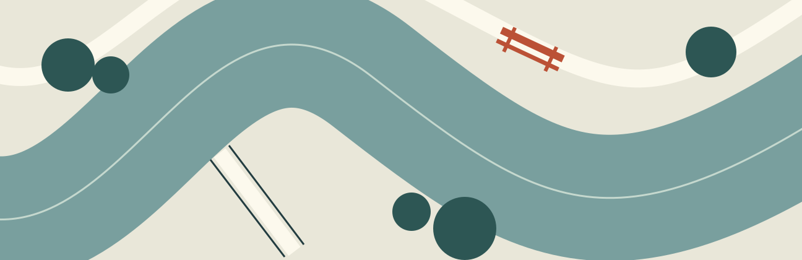
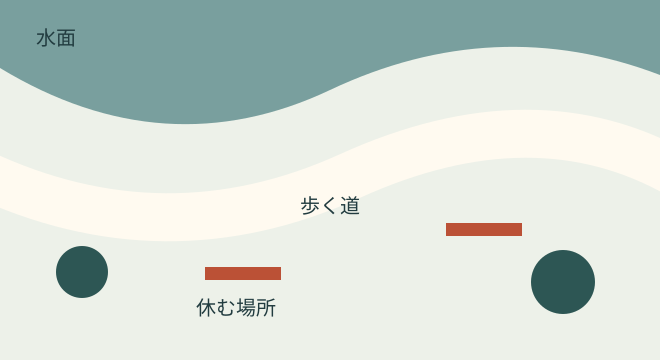

# 水辺に、余白をつくる

FIELD NOTES / 01　文・図版：サンプル編集室

急いで通り過ぎていた道に、腰を下ろせる場所が一つできた。架空の町「凪野」を舞台に、川沿いの小さな居場所をめぐる、ある朝の記録。

## 歩く速さで見つける

橋を渡るとき、私たちはたいてい向こう岸を見ている。その朝も、目に入ったのは駅へ向かう坂と、まだ閉まっている店の看板だった。けれど欄干の下から水の音がして、足が一度だけ止まった。川は思っていたより近い。堤防から細い階段を下りると、通勤の列が急に遠くなった。

川沿いの道には、新しいベンチが三つ置かれていた。どれも川に正対せず、少しだけ斜めを向いている。座ってみると、流れの先に橋が入り、視線を動かせば通りの人も見えた。景色を見るためだけの席ではない。誰かを待つにも、靴ひもを結び直すにも、ちょうどよい向きだった。

町の仕事場で家具を直している人が、工具箱を抱えてやって来た。ここに置くものは、長く残る形よりも、長く手を入れられる形にしたかったのだという。板を留めるねじは見える位置にあり、脚の下には水がたまらない隙間がある。小さな工夫は、座る人にはほとんど見えない。

## 決めすぎない場所

ベンチの横には、使い方を説明する大きな看板がなかった。代わりに、小さな札が一枚だけある。「次の人のために、少し場所をあけてください」。ここで本を読んでも、昼食を広げてもよい。何もしないでいてもよい。目的のない時間まで受け止められることが、この場所の大切な役割なのだろう。

> [!note] 観察の手帳
> 同じ場所を朝・昼・夕方に訪れると、日陰の位置や音の届き方が変わる。使う人の数だけでなく、立ち止まる理由と、立ち去るきっかけも短く書き留めてみよう。

通りから川までの距離は、歩けば数分しかない。それでも以前は、ここを遠い場所だと思っていた。下りた先に何があるのか、道の上から見えなかったからだ。階段の入口に明るい色の手すりが加わり、草が刈られたことで、道の続きが分かるようになった。居場所をつくる仕事は、席そのものより手前から始まっている。

## 残すために、直す

川はいつも同じ顔をしているわけではない。雨の翌日は流れが速く、風の強い日には細かなしぶきが道まで届く。この町の人たちは、動かせるものを増やしておくことにした。小さな机も案内の札も、必要なときには上の倉庫へ運べる。季節に合わせて置き直す作業が、場所の様子を確かめる時間にもなる。

昼前になると、パンの袋を持った二人がやって来た。二人は少し離れたベンチに座り、話すでもなく川を眺めている。しばらくして片方が袋を差し出し、もう片方が身を乗り出した。場所のよさを説明する言葉より、そうした動きのほうが多くを教えてくれることがある。

最初から完成した場所を目指すと、何を置くかという話に時間を使ってしまう。ここではまず、座れる板を一枚置いた。日差しを避けて少し動かし、通り道をふさぐと分かればまた動かした。試すことと直すことを、別の仕事にしなかった。その積み重ねが、今の三つのベンチになっている。

## 道具をしまう時間

倉庫へ戻る途中で、さっきの工具箱をもう一度見かけた。中には大きさの違うねじと、使い込まれた布が入っている。修理に来た人は、今日使ったものを一つずつ確かめながら、箱の中の決まった場所へ戻していた。片づけが終わるまでが、川辺での仕事なのだという。

倉庫の壁には、季節ごとの川の絵が貼ってあった。水が増えた日、草が伸びた日、木陰がベンチまで届いた日。正確な測量図ではなく、その場で気づいたことを持ち寄った記録だ。何も書かれていない週もある。それを失敗だと思わず、次に来た人が続きを描けるようにしている。

記録を読むと、同じ場所でも人によって見ているものが違うことが分かる。鳥の名前を書く人もいれば、地面のぬかるみを気にする人もいる。ひとつの見方に揃えるより、違いを並べておく。そのほうが、困りごとにも、まだ知らなかった楽しみにも気づきやすい。

> [!note] この町の小さな約束
> 使ったものを戻す。気づいたことを一行残す。分からないことは、そのまま次の人に渡す。続けるための約束は、覚えられるくらいの長さでよい。

作業のために集まる日も、何もしない日も、ここでは同じカレンダーに載っている。誰かが毎日頑張らなければ保てない場所にはしたくない、と工房の人は言った。休める仕組みをつくることも、長く使い続けるための設計なのだろう。私はその言葉を手帳の端に書き、工具箱のふたが閉まる音を聞いた。

## 帰り道の目印

夕方、もう一度橋を渡った。水面は朝より暗く、窓の明かりが細く揺れていた。ベンチには誰もいなかったが、場所が空っぽだとは思わなかった。さっきまで人がいた気配と、このあと誰かが来る余地が、同じ景色の中に残っている。

私は次の休みに持って来る本を考えながら、坂を上った。新しい名所ができたわけではない。遠くから人を呼ぶための大きな仕掛けもない。ただ、いつもの道に、少し遠回りする理由が生まれた。町の余白は、そんなふうに毎日の予定の端へ入り込んでくる。
