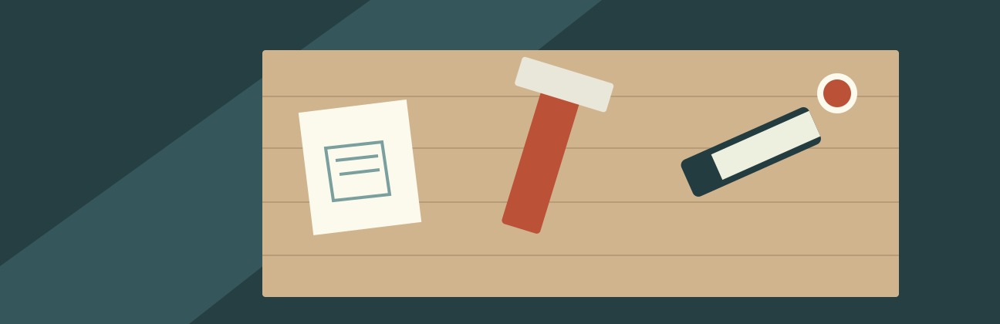

# 一脚から始まる、町の仕事

FIELD NOTES / 02　文・図版：サンプル編集室

直すことは、前の姿に戻すことだけではない。川辺のベンチが生まれた小さな工房で、使い続けるための工夫を聞く。この記事も架空の読み物です。

## 傷を読む朝

工房の扉を開けると、机の上に椅子が一脚載っていた。作業をする人は、それを床へ下ろし、座り、体重を移して音を聞いた。最初の道具は、自分の体なのだという。

きれいに塗り直すだけでは、ぐらつきは消えない。逆に、継ぎ目を締め直すだけで、古い傷が魅力に見えてくることもある。何を残し、何を変えるか。その順番を考える時間が、机の上で手を動かす時間と同じくらい必要になる。

## 誰でも続きを担えるように

川辺のベンチでは、特別な工具がなくても板を交換できるようにした。寸法は一枚の紙にまとめ、作業の順番を簡単な絵で添えている。自分しか分からない工夫を増やすと、その人がいない日に作業が止まる。次の人へ渡せる形にすることも、ものづくりの一部なのだ。

> [!tip] 小さな引き継ぎ
> 部品の寸法、使った道具、直した日を一緒に残す。うまくいった方法だけでなく、外しにくかったねじの位置も記録しておくと、次の手入れが始めやすくなる。

使う人から届く言葉には、設計図にない情報が含まれている。荷物を置く場所がほしい。立ち上がるときに手をつきたい。雨がやんだら早く座りたい。その全部を一度に叶えることは難しい。それでも、聞いたことを小さな変更として返していけば、相談は次の仕事につながっていく。

## 仕事の終わりを開いておく

午後、直した椅子を受け取りに来た人は、まず背もたれをなでた。新しくなった部分より、残っている傷を見つけて笑った。変わらないところがあるから、直ったところにも気づけるのかもしれない。工房の人は、また音がしたら持って来てください、と声をかけた。
