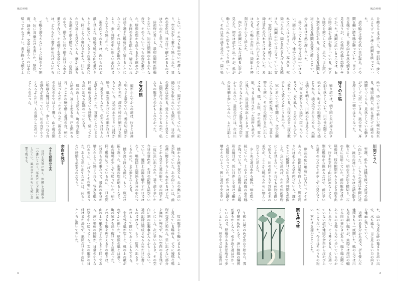

# 図版付きの縦書き段組み

[サンプル・カスタマイズ集へ戻る](../../README.md)

Vivlioでそのまま試せる、Markdown原稿・YAML設定・CSS・図版のサンプルです。ページ上部に横長の図版、下部に縦書き本文三段を置き、題名、著者名、縦罫線付き節見出し、柱とページ番号を組みます。

Vivlio **0.17.3**、A4・縦書きで確認しています。ベーステーマの読み込みは不要です。内蔵テーマではなく、Vault内へ保存して選択するCSS作例です。



- [Markdown原稿：風の尾根](book/01-風の尾根.md)
- [本の設定：vivlio.yaml](book/vivlio.yaml)
- [CSS](vertical-feature.css)
- オリジナル図版：[横長の山並み](book/images/ridge.svg)・[縦長の林](book/images/trees.svg)

## 試す手順

1. この `vertical-feature` フォルダ全体を、ObsidianのVault内の任意の場所にコピーします。
2. Obsidianで **`vertical-feature/book` フォルダを対象に** Vivlioのプレビューを開きます。
3. 再ビルドし、図版の下の本文三段と、続きのページを確認します。

GitHubからフォルダ一式を取得する場合は、リポジトリの **Code → Download ZIP** を使い、展開した中の `sample/css/vertical-feature` をコピーします。この作例専用のZIP・PDF・EPUBは同梱していません。

### 見開き表示について

柱とページ番号は小口側に配置します。左ページは左上・左下、右ページは右上・右下です。CSSの `@page :left` と `@page :right` で指定しています。

**設定 → Vivlio → プレビュー → ページ表示モード → 見開き** を選び、再ビルドしてください。「画面に合わせて表示する」もオンにします。見開きの表示設定はVault共通で、CSSや `vivlio.yaml` からは切り替えられません。

このサンプルは右綴じで、1ページ目が左ページです。最初の画面では1ページ目だけが表示されます。**一つ先の見開きへ進むと、右の2ページ＋左の3ページ** が並びます。付属原稿は初期設定で3ページになる量を収録しているため、この見開きで左右の段組みと本文のつながりを確認できます。フォントや文字サイズを変えるとページ数も変わります。

```text
Vault/
└─ vertical-feature/
   ├─ README.md
   ├─ vertical-feature.css
   ├─ spread-preview.png
   └─ book/
      ├─ vivlio.yaml
      ├─ 01-風の尾根.md
      └─ images/
         ├─ ridge.svg
         └─ trees.svg
```

説明用READMEは `book` の外にあるため、本文に含まれません。`vertical-feature` 自体を組版対象にはしないでください。原稿はフォルダ単位で組む前提で、`#` が記事の題名、`##` が節見出しです。

`theme: ../vertical-feature.css` は `book/vivlio.yaml` からの相対指定です。フォルダ内の構成を保てば、Vault 内のどこへ移動しても、外側のフォルダ名を変えても修正不要です。この指定にはVivlio 0.17.4以降が必要です。未対応の 0.17.3 では、`theme` を CSS の Vault ルート基準のパス（例: `vertical-feature/vertical-feature.css`）へ変更してください。

このCSSはVivlioの書籍用です。Obsidianの外観設定のCSSスニペットには登録しません。本文ページ用の作例なので、同梱設定では扉・目次・奥付を無効にしています。

## 原稿の書き方

付属のMarkdown原稿は次の構造です。HTMLタグは不要です。

```markdown


# 風の尾根

サンプル編集室

## 朝の道

町の最後の家を過ぎると、道は川に沿ってゆるやかに曲がった。

## 尾根の風

尾根に出ると、風は一つの方向から吹いてくるわけではなかった。
```

最初の見出しより前に置いた先頭画像を上端の図版、題名直後の段落を著者名としてCSSが扱います。本文途中にも画像を挿入できます。画像の代替テキストは残し、VFMが自動生成する図版キャプションは非表示にします。

自分の原稿へ置き換えるときも、段ごとの分割や空白行による位置合わせは不要です。写真を使う場合は、自分で撮影したものや利用条件を確認した画像を `images` に置き、Markdownの画像パスと代替テキストを変更します。先頭図版は高さ56mmの枠を埋めるようにトリミングされます。

### 本文途中の画像

画像の前後に空行を入れ、独立した段落として書きます。サンプル原稿の「尾根の風」に横長画像、「雨を待つ林」に縦長画像を入れています。

```markdown
ここまでが本文です。


ここから本文が続きます。
```

本文画像は **幅44mm・高さは一段分** の枠に、元の縦横比を保って全体を収めます。切り抜きや引き伸ばしは行わず、比率によって枠内に余白ができます。段をまたがず、今の段の残り幅に入らなければ枠ごと次の段へ移ります。文章は画像の右から左へ続き、枠内の余白への回り込みは行いません。

幅はCSSの `--feature-inline-image-width` で調整できます。画像側のMarkdownサイズ指定より、この作例の枠サイズを優先します。図版の説明を印刷したい場合は、画像とは別の本文段落として書いてください。

### コールアウトを囲みコラムにする

Obsidianのコールアウト記法が、縦書きの囲みコラムになります。本文より少し小さい文字と薄い背景で、補足や読み物を区別できます。

```markdown
> [!note] コラム　景色を読む
> 同じ場所で少し待つと、初めは気づかなかった動きが見えてくる。
>
> 手帳には、そのとき感じたことも書いておこう。
```

`[!note]` などは薄い生成り色の背景と罫線、`[!tip]` は淡い緑の背景と二重罫線になります。タイトルは自由に変更でき、原稿に指定した位置で本文の流れに入ります。同梱設定の `syntax.callout: true` で変換を有効にしています。

長いコラムは次の段・ページへ続きます。枠を固定寸法に押し込めず、分割先にも背景・罫線・内側の余白を付けます。タイトルは冒頭だけに表示し、直後の本文と離れないようにしています。サンプルには短い補足と複数段落のコラムを収録しています。

### 複数のMarkdown原稿を使う

`book` に `02-次の紀行.md` などを追加すると、通常はファイル名の自然順で読み込まれます。`index.md` のリンク順や `vivlio-order` を指定した場合は、その設定に従います。各ファイルは別の記事として新しいページから始まり、前の記事の余った段には続きません。ページ番号と見開きの左右は本全体で続きます。

各原稿で `#` を題名、その直後の段落を著者名として書きます。各原稿の見出しより前に先頭画像を置くと、その記事の上部図版になります。画像なしなら四段組です。`startSide: any` のため、記事を毎回左ページへ送ることはしません。

## 段組みの仕組みと調整

`writing-mode: vertical-rl` と `column-count: 4` を組み合わせています。縦書きでは段が上から下へ並び、各段の中は右から左へ流れます。先頭図版の `float-reference: page; float: top` が上端の一段分を占めるため、最初のページの本文は三段になります。図版のない続きのページは四段です。

| 変更 | CSS・設定 |
|---|---|
| 本文サイズ | YAMLの `baseFontSize: 10pt` |
| 段間 | CSSの `--feature-gap: 7mm` |
| 図版高 | CSSの `--feature-image-height: 56mm` |
| 本文画像の枠幅 | CSSの `--feature-inline-image-width: 44mm` |
| 段数 | YAMLの `columns` とCSSの `--feature-columns` を同じ値へ |
| 用紙・余白 | YAMLの `size` とCSSの `@page` の `margin` |
| 柱 | YAMLの `title` |
| 縦罫線 | CSSの `--feature-rule` と `h2` の `border-block-start` |

初期設定はA4、版面高262mm、段間7mmで、一段は約60mmです。図版56mmと下余白7mmが先頭段を占めます。用紙や図版高を変えると上段に短い本文が入ったり、図版が二段分を占めたりするため、再ビルドして確認してください。字数・行数は `null` にして、CSSの余白で版面を決めます。

## 確認済みの範囲

同梱Markdown・YAML・CSS・SVGを、Obsidian APIのテスト用代替を使ってVivlioの `buildBook` に読み込ませ、同梱ViewerとChromeで3ページに組版しました。設定と画像の読み込みに警告がないこと、先頭ページの図版・本文三段・柱・ノンブル、ページをまたぐ全段落の連続性を確認しています。見開きモードでページを送り、本文のある2ページ目が右、3ページ目が左に同時表示されることも確認済みです。Obsidianアプリ内での操作確認は含みません。

ページフロートはVivliostyle向けの機能です。Obsidianの通常の閲覧表示や、リフローEPUBでは同じページ配置になりません。

確認はVivlioのプレビュー経路で行っています。PDF書き出しとリフローEPUBでの表示は未検証です。見開きの画像は表示例であり、フォント環境によって改ページや文字の位置は変わります。

コールアウトは短いもの・複数段落のものに加え、検証用の長文を使って段・ページをまたぐ場合も確認しました。本文の欠落と囲み枠の紙面外へのはみ出しがないことを検証しています。

## 参考と素材の扱い

構成の参考：[Vivliostyle「白馬岳」サンプル](https://github.com/vivliostyle/vivliostyle_doc/tree/gh-pages/samples/shirouma)（2026年9月23日参照）。縦書きの複数段と上端のページフロートという実装方法を参考にしています。

参照先のCSS、本文、写真、背景画像、添付スクリーンショットは転載していません。CSS・本文・SVGはこの作例のために新規作成したもので、本文は架空の紀行、図版は山並みの模式図です。本作例はリポジトリのライセンス（AGPL-3.0-or-later）に従います。差し替える画像やフォントの利用条件は、それぞれの素材に従ってください。
