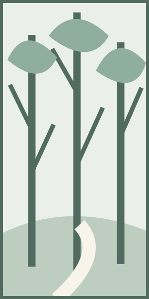

# 風の尾根

サンプル編集室

## 朝の道

町の最後の家を過ぎると、道は川に沿ってゆるやかに曲がった。まだ日の届かない岸辺では、草の先に小さな水滴が残っている。橋の中央で足を止めると、川底の丸い石が水の動きに合わせて揺れて見えた。私たちは地図を広げ、尾根へ上がる道を指でたどった。今日は頂を目指すのではなく、途中の景色をゆっくり読むために歩くことにしていた。

林に入ると、遠くの山はすぐに見えなくなった。その代わり、目の前のものの形がはっきりしてくる。折れた枝の切り口、木の根が土を押し上げた跡、雨に削られた小さな溝。それらは地図には記されないが、道の表情をつくっていた。曲がり角のたびに立ち止まっていると、距離はなかなか縮まらない。それでも、歩いてきた時間だけは確かに厚く積もっていく。

最初の休憩は、三本の木が並ぶ場所にした。荷物を下ろすと背中に風が通り、遠くで鳥の短い声がした。手帳には、道幅や方角ではなく、風の冷たさを書き留めた。数字にならないことを記録するには、言葉を急いで決めないほうがよい。しばらく待つと、冷たいという一語の中にも、水辺の湿り気や木陰の静けさが混じっていることに気づいた。

林の出口は思ったよりも明るかった。低い枝の向こうに空が開き、草の斜面がなだらかに続いている。町から眺めたときには一つに見えた尾根が、ここではいくつもの重なりになっていた。近い稜線は濃く、奥の稜線ほど淡い。山の高さを測らなくても、その色の違いだけで、間に横たわる大きな空間を感じることができた。

## 尾根の風

> [!note] コラム　景色を読む
> 山の名前を覚えるだけでなく、稜線の重なりや雲の影を見てみる。同じ場所で少し待つと、初めは気づかなかった動きが見えてくる。
>
> 手帳には、目に入ったものと、そのとき感じたことを分けて書いておくと、あとから散歩の記憶をたどりやすい。

尾根に出ると、風は一つの方向から吹いてくるわけではなかった。斜面を上がる流れと谷へ下る流れが、草の上で短く触れ合っている。帽子を押さえるほどの風が通ったかと思うと、次の瞬間には手帳の紙さえ動かない。私たちは平らな石に腰掛け、遠くの雲が峰を越えるまで待った。雲の影は、歩く人よりずっと速く斜面を渡っていった。

道の脇には背の低い草が群れ、その間を細い踏み跡が縫っていた。目立つ花を探すより、葉の向きや茎の傾きを見るほうが、この場所の風を想像しやすかった。地面に近いところでは、石の陰に細かな砂が集まっている。大きな眺めを前にしても、足元へ目を戻すと別の景色がある。遠くを見る時間と近くを見る時間を交互に置くことで、歩く速さは自然に遅くなった。

昼になっても空の青さは均一ではない。頭の上は深く、地平に近づくにつれて白くほどけていく。写真を一枚撮ったあと、同じ景色をしばらく見続けた。画面の中では止まっている雲が、実際には形を変え続けている。記録は景色の代わりにはならないが、あとでその変化を思い出すための入口にはなる。手帳の余白には、撮影した時刻だけを小さく添えた。

向かいの斜面に一本だけ明るい帯が見えた。初めは道かと思ったが、雲が動くにつれて帯もゆっくり移っていく。それは光の通り道だった。同じ場所でも、待つだけで新しい線が現れる。地図を閉じ、何も書かずに眺める時間をつくると、見落としていた動きが少しずつ戻ってきた。風の音も、耳を澄ますほど一様ではなくなった。

## 帰りの手帳

帰り道では、朝と同じ木が違う向きの影を落としていた。川の音が聞こえ始めると、町までの距離が急に短く感じられた。橋で再び足を止める。水面は朝より明るく、川底の石は見えにくい。何も変わらない場所へ戻ったつもりでも、光も風も、自分の目も少しずつ変わっている。往復の道を二度の散歩として覚えておこうと思った。

家に着いて手帳を開くと、文字の間に小さな土の粒が残っていた。文章を整える前に、その日の順序を思い出してみる。橋、木陰、草の斜面、雲の影。うまく書けなかった箇所も消さずに残した。後日読み返したとき、言葉の足りなさがかえって風景を呼び戻すかもしれない。最後の行には、次は川の反対側を歩いてみたい、とだけ記した。

## 川向こうへ

翌週、私たちは橋を渡って反対の岸へ向かった。こちらの道は水面に近く、流れの速いところでは会話が聞き取りにくい。朝の光が川を横切り、石の上に反射していた。前の散歩で見た尾根は、枝の隙間からときどき顔を出す。行き先を同じ山に決めなくても、別の場所から眺めるだけで、前に歩いた道とのつながりが少しずつ見えてくる。

岸辺の広い場所には古いベンチがあった。座面は雨で白くなり、脚の周りには柔らかな草が伸びている。誰かがここに腰掛けて川を見た時間を想像した。急いで通れば、ただの休憩場所にしか見えない。それでも荷物を置いて座ると、川の曲がり方や対岸の木の並びが、ここから眺めるために整えられたように思えた。

少し先で道は水から離れ、畑の端へ続いていた。土の上には昨夜の雨の跡が残っている。乾いた場所と湿った場所の境目が、低い日差しを受けて細かな模様になっていた。私たちは足跡を増やさないよう、固い道の中央を歩いた。山の上で見た砂の集まりを思い出す。水も風も、目に見えない力の向きを地面に残していく。

道標のある分かれ道で、折り畳んだ地図をもう一度開いた。紙の上では川も道も細い線だが、実際には岸辺の幅や木陰の奥行きがある。線と線の間にあるものを知るために歩いているのかもしれない。そう考えると、まだ通っていない道が地図の余白から浮かび上がるようだった。今日はそのうちの短い一本だけを選ぶことにした。

## 雨を待つ林

午後には空の色が変わり始めた。雲の下側が灰色になり、遠い稜線の輪郭が柔らかくなる。引き返す道は分かっていたので、屋根のある休憩所まで歩くことにした。林の中ではまだ雨音はしない。それでも葉の匂いが濃くなり、空気が少し重たく感じられた。景色の変化は、目だけで確かめるものではないのだと思った。

休憩所に着くと、最初の雨粒が屋根をたたいた。初めは間隔のある小さな音で、そのうちいくつもの音が重なった。屋根の端から落ちる水を眺めながら、水筒のお茶を飲んだ。晴れていれば通り過ぎた場所に長く留まることになったが、それは予定が崩れたというより、歩く時間の中に新しい余白ができたような感じだった。

雨の向こうの木々は、近いものほど濃く見えた。尾根で眺めた山の重なりとよく似ている。大きさの違う景色にも、同じような奥行きがある。柱にもたれて遠くを見ていると、葉から落ちる水滴が手前を横切った。一つの視野の中で、動かない幹と動き続ける水が重なり合う。その様子を文章にするには、どちらから書き始めればよいだろう。

手帳を濡らさないように膝の上で開き、短い言葉だけを書いた。屋根、雨、緑の奥。文章に整えるのは家に帰ってからでよい。書き終えて顔を上げると、雨はすでに弱まっていた。記録に気を取られている間にも、目の前の景色は変わる。覚えることと見ることの間を行ったり来たりするのが、私たちの散歩なのかもしれなかった。

## 夕方の橋

雨が止んでからの道は、行きとは違う明るさを帯びていた。雲の切れ間から差す光が、濡れた幹の片側だけを照らしている。足元の水たまりには枝が映り、風が通るたびにその形がほどけた。道を下りながら、私たちはほとんど話をしなかった。言葉にしないまま同じ場所を見ている時間も、帰ってから思い出せる記録の一つになる。

橋の近くまで戻ると、町の音が聞こえ始めた。遠くを走る車、戸を閉める音、どこかの庭で動く道具の音。朝には気づかなかったそれらが、雨のあとの空気の中ではよく響く。山と町の間に明確な境目はなく、歩くにつれて音の割合が変わっていく。川の音が小さくなるぶんだけ、人の暮らしが近づいてくるのだった。

橋から上流を見ると、谷の奥に淡い光が残っていた。あの向こうには、前の週に腰を下ろした石があるはずだ。そこから見えた雲の影や、草の傾きが一度に思い出された。違う道を歩いた今日の景色が、先日の記憶と結びついていく。地図上の線を増やすだけではなく、場所同士の関係を自分の中につくるために、また歩きたくなる。

橋を渡り終える前に、もう一度だけ振り返った。雨雲の端が明るくなり、山の輪郭が少しずつ戻っていた。朝と同じ場所に立っているのに、一日の間に見たものが重なって、景色の中身が増えたように感じられる。写真を撮る代わりに、しばらくその場に留まった。あとで思い出すためには、何もしない時間も必要なのだろう。

## 余白を残す

> [!tip] 小さな記録の工夫
> 日付と天気に加え、休憩した場所を一つ書いておく。写真だけでは思い出しにくい、風の音や土の匂いも短い言葉で残せる。

二度の散歩を手帳にまとめると、よく覚えている場所と、すでに曖昧な場所が交互に現れた。思い出せない部分を無理に埋めず、短い空白のまま残すことにした。次に歩いたとき、その空白に別の出来事が入るかもしれない。道の記録は完成させるためだけに書くものではなく、もう一度外へ出るきっかけとして置いておくこともできる。

窓の外で風が吹くと、机の上の紙がわずかに動いた。尾根の風とは違う、町の家々を通り抜けてきた風だった。それでも手帳を押さえる手の動きは、山の上で紙を押さえたときと同じである。遠い場所の経験が、日常の小さな仕草の中へ戻ってくる。次の散歩の日付はまだ決めず、地図だけを手の届くところに置いておいた。
