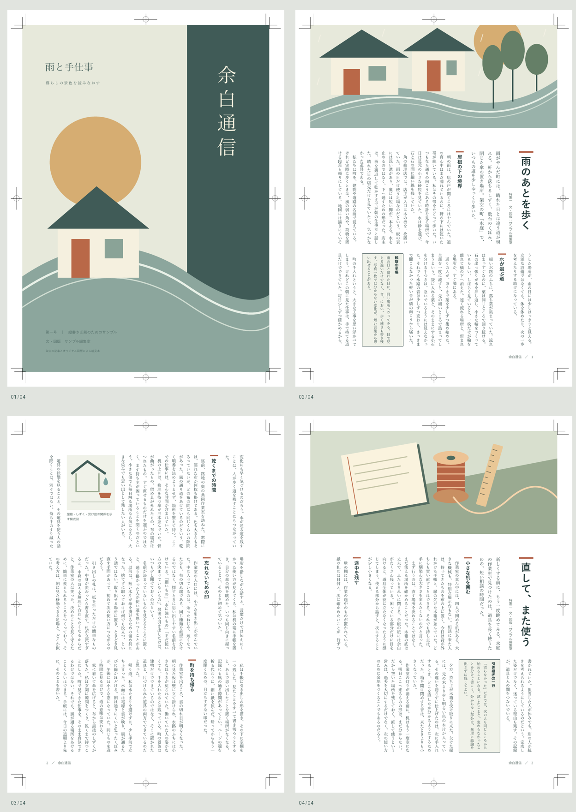

# 縦書き印刷用マガジン「余白通信」

A4・右綴じ・縦書き三段を基本にした、Vivlio **0.17.4以降** 用の独立CSSです。記事冒頭は裁ち落とし図版と本文二段、続きのページは本文三段。縦見出し・リード・囲みコラム・段内図版・小口側のノンブルを備えています。



- [CSS](vertical-magazine.css) ／ [組見本PDF（トンボ付き）](vertical-magazine.pdf)
- [原稿一](book/01-rain.md) ／ [原稿二](book/02-repair.md) ／ [本の設定](book/vivlio.yaml)
- [素材の来歴・ライセンス](SOURCES.md) ／ [ライセンス本文](LICENSE)

## 使い方

1. ZIPを展開し、`vertical-magazine` フォルダ全体をObsidianのVault内の任意の場所へコピーします。
2. **`vertical-magazine/book` フォルダを対象に** Vivlioプレビューを開き、再ビルドします。
3. PDF書き出しで仕上がりを確認します。用紙サイズはA4、塗り足しは3mm、トンボは有効が既定です。

`theme: ../vertical-magazine.css` は `book/vivlio.yaml` からの相対指定です。フォルダ内の構成を保てば、Vault 内のどこへ移動しても、外側のフォルダ名を変えても修正不要です。この指定にはVivlio 0.17.4以降が必要です。未対応の 0.17.3 では、`theme` を CSS の Vault ルート基準のパス（例: `vertical-magazine/vertical-magazine.css`）へ変更してください。

`vertical-magazine` 自体を組版すると説明用Markdownまで収録されるため、必ず `book` を対象にします。CSSはVivlioのテーマとして使い、Obsidianの外観用CSSスニペットには登録しません。内蔵テーマの追加読み込みも不要です。

```text
vertical-magazine/
├─ README.md / SOURCES.md / LICENSE
├─ vertical-magazine.css
├─ vertical-magazine.pdf / preview.png
└─ book/
   ├─ vivlio.yaml
   ├─ 01-rain.md
   ├─ 02-repair.md
   └─ images/
      ├─ cover.svg
      ├─ rain.svg
      ├─ repair.svg
      └─ detail.svg
```

## 原稿の書き方

```markdown


# 記事の題名

特集一　文・図版：著者名

ここに記事のリードを書きます。

## 節見出し

ここから本文です。

> [!note] コラムの題名
> 本文と区別して載せたい補足を書きます。
```

先頭の独立した画像を裁ち落とし図版、H1直後の段落を著者欄、その次をリードとして扱います。先頭画像の代替テキストは残し、印刷キャプションのみ非表示にします。必要な画像クレジットは著者欄などにも記載してください。途中の独立画像は幅42mmで全体を収め、代替テキストを横書きキャプションとして印刷します。長いキャプション・背の高い画像は、一段に収まるよう調整してください。

各Markdownファイルは別の記事として新しいページから始まります。短い記事の末尾には余白が残ります。長い文章は段・ページを自動的にまたぎます。段ごとの手動改行は不要です。表紙にはページ番号を付けず、本文は1から続きます。右綴じなので、表紙の次の本文1ページ目は右ページです。

見開きは「設定 → Vivlio → プレビュー → ページ表示モード」で指定します。YAMLやCSSからViewerの見開き表示自体は切り替えません。

## 塗り足しと画像の差し替え

**`bleed: 3mm` を指定するだけでは、画像は紙端の外まで伸びません。** このCSSでは実際の画像枠も拡大しています。

| 対象 | 仕上がり・画像枠 | 処理 |
|---|---|---|
| 表紙 | A4 210×297mm／画像216×303mm | プラグインの表紙機能で四辺を各3mm延長 |
| 記事の先頭画像 | 画像216×90mm | 上・左右を仕上がり線の3mm外まで延長。下辺は紙面内 |
| 本文途中の図版 | 幅42mm／高さは比率から計算 | 紙端に接しないため塗り足しなし。切り抜かずに全体を表示 |

表紙SVGは216×303mm、先頭SVGは216×90mmで作成してあります。背景色や線が画像端まで続いています。表紙の文字は仕上がり線から十分内側に置いています。写真へ差し替える場合は、文字・顔などの重要部分を**仕上がり線から少なくとも5mm内側**に置き、印刷所の指定があればそちらを優先してください。`object-fit: cover` は比率を保って枠を埋めるため、比率の異なる写真の周囲は切れます。余白のない写真から、CSSが新しい風景を生成することはありません。

ラスター画像を実寸300ppiで使う場合の目安は、表紙が2552×3579px以上、先頭図版が2552×1063px以上です。拡大・トリミング後の有効解像度で確認します。SVGはベクター図版なのでこの画素数制約を受けません。

トンボありでは、仕上がり線の外に塗り足しとトンボを含む約242×329mmのPDF用紙になります。トンボなしでも3mmの塗り足しを維持すると、Vivlioは216×303mmの用紙を作ります。この場合の断裁位置は外周から3mm内側です。CSSはプラグインの `--vivlio-bleed-offset` に合わせて位置を切り替えます。A4実寸で余白内に収めて家庭用プリンターへ出す設定例は `cropMarks: false` と `bleed: 0mm` ですが、プリンターの非印字領域は別途考慮してください。

判型・段数・上下余白・先頭図版の高さを変えると段の収まりが変わります。YAMLの `columns: 3` とCSSの `column-count: 3` は揃えてください。A4版面高260mm、段間8mmで一段は約81.3mmです。先頭の90mm図版は上余白・塗り足しへ張り出し、下余白を含めて冒頭の一段分を占めます。

## 組見本と検証範囲

付属PDFは表紙＋記事一の2ページ＋記事二の1ページ、全4ページです。Vivlioの `buildBook`、同梱Viewer、Chromeを使って生成し、全ページをPNGにして見た目を確認しました。Obsidian APIのみテスト用の代替を使っています。Obsidianアプリ内操作と実際の印刷・断裁は未検証です。

トンボの有無それぞれで、全画像の読み込み、本文の連続性、縦見出し、文字の紙面内配置、先頭図版の上・左右の塗り足し、表紙四辺の塗り足しを測定しています。再現用スクリプトはリポジトリの `test/vertical-magazine.check.ts`、梱包は `test/package-vertical-magazine.mjs` です。

PDFはViewerから生成した組見本で、入稿用PDF/XやCMYK変換を施したものではありません。TrimBox・BleedBoxの設定も保証しません。入稿時は印刷所のPDF仕様に合わせて仕上げてください。フォント環境によって改ページは変わります。外部フォントは同梱していません。EPUBはこの固定レイアウトの対象外です。

## 参考

[Vivliostyle Web Magazine Sample](https://github.com/vivliostyle/vivliostyle_doc/tree/gh-pages/samples/webmag) の縦書き印刷用を参考に、縦書き・段組み・図版・柱とノンブル・A4と3mm塗り足しをVivlio向けに実装しました。参照先のページマスター、左右非対称の専用フロー、ロゴ、記事、写真は転載していません。この作例では通常のMarkdownとページフロートを用います。来歴と再配布条件は [SOURCES.md](SOURCES.md) を参照してください。
