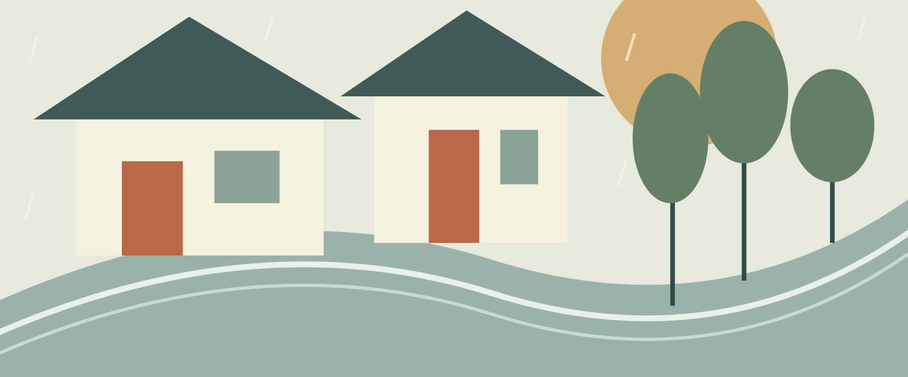
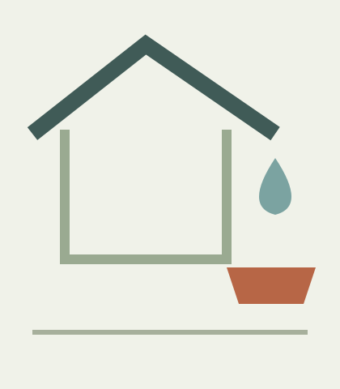

# 雨のあとを歩く

特集一　文・図版：サンプル編集室

雨がやんだ町には、晴れた日とは違う道が現れる。軒から落ちるしずく、敷石のくぼみ、閉じた傘の置き場所。架空の町「水庭」で、いつもの道を少しゆっくり歩いた。

## 屋根の下の境界

朝の雨は、店の戸が開くころにはやんでいた。道の真ん中はまだ濡れているのに、軒の下には乾いた帯が続いている。私はその帯をたどって歩いた。いつもなら通りの向こうにある時計を見る場所で、今日は足元の小さな砂粒を見ていた。水は砂を運び、石と石の間に細い線を残していた。

角の修理店では、店主が入口に木の板を一枚置いていた。雨の日だけ使う足場なのだという。板の表には浅い溝があり、裏には短い脚が二本ある。水を止めるのではなく、下へ通すための形だった。店主は、板を裏返して乾かすまでが朝の仕事だと話した。晴れた日の店先だけを見ていたら、気づかなかった道具である。

私たちは町を、建物や道路の名前で覚えている。けれど実際に歩くときは、風の弱い角や、荷物を置ける段差も頼りにしている。地図には描きにくいそうした場所が、雨の日には少しはっきりと見える。立派な設備ではなくても、体を休めたり、次の一歩を考えたりする助けになっている。

## 水が選ぶ道

細い水路のふちに、落ち葉が集まっていた。流れはまっすぐなのに、葉は同じところで回り続ける。石の出っ張りが水を押し返し、小さな輪をつくっているらしい。しばらく見ていると、一枚だけが輪を離れて橋の下へ消えた。速く流れる場所と、留まれる場所が、すぐ隣にある。

通りの人が、ほうきで葉を少しずつ集め始めた。全部を一度に流すと、先の細いところで詰まってしまうという。袋に入れる葉と、そのままにする小石を分ける手つきは、急いでいるようには見えなかった。それでも水路の音は少しずつ変わり、さっきまで聞こえなかった軽い音が橋の向こうから届いた。

> [!note] 観察の手帳
> 雨の日と晴れた日に、同じ場所へ立ってみる。目で見える違いだけでなく、音、におい、歩く速さも書き残す。写真一枚では分からない変化が、短い言葉から思い出せることがある。

町の手入れというと、大きな工事を思い浮かべてしまう。けれどこの朝に見た仕事は、手で持てる道具だけでできていた。毎日少しずつ確かめるから、変化にも早く気づけるのだろう。水が通る道を残すことは、人が歩く道を残すことにもつながっていた。

## 乾くまでの時間

昼前、路地の奥の共同作業室を訪ねた。窓際には、濡れた布が何枚も掛けてある。色も大きさもそろっていないが、どの布の間にも同じくらいの隙間があった。風の通り道をあけているのだという。乾く順番を決めようとせず、場所を整えて待つ。ここでの仕事には、そんな時間が含まれていた。

机の上には、修理を待つ傘が三本並んでいた。骨が曲がったもの、留め具が外れたもの、布の端がほつれたもの。すぐ直せるものだけを選ぶのではなく、まず持ち主が困っていることを聞くのだという。小さな傷でも毎日触る場所なら気になるし、大きな染みでも思い出として残したい人がいる。

道具の状態を見ることと、その道具を使う人の話を聞くことは、別々ではない。持ち手のすり減った場所を指しながら話すと、言葉だけでは伝えにくかった使い方が見えてくる。私は机の端に手帳を置き、自分の傘の柄を眺めた。いつも同じ向きに握っていることに、そのとき初めて気づいた。

## 忘れないための印

作業室の入口には、小さな引き出しが並んでいた。中に入っているのは、余ったねじや、短くなったひも、布の切れ端である。同じ種類を厳密に分けるのではなく、探すときに思い出しやすい名前を付けている。「細いもの」「水に強いもの」「まだ使い方の決まっていないもの」。最後の引き出しだけは、いつも少し開けておくのだという。

名前が決まっていないものを見えるところに置くと、通り掛かった人が使い道を思いつくことがある。以前は、短い木片が傘を掛けるための留め具になった。捨てずに取っておけば何でも役立つ、という話ではない。取り出せる場所に置き、ときどき見直す手間があって、初めて次の使い方につながるのだろう。

引き出しの札は、紙を折っただけの簡単なものだった。中身が変わったら書き直す。札が立派すぎると、中身のほうを無理に合わせたくなるからだと、作業室の人は笑った。決めたことを長く守るために、簡単に変えられるところをつくっておく。その考え方は、朝に見た移動できる足場と、どこか似ていた。

私は手帳に引き出しの形を描き、その下に空欄を一つ残した。見たことをすべて書き切ろうとすると、あとで思い出したことを置く場所がなくなる。記録にも風の通る隙間があってよい。ページの端を折る代わりに、細い紙を挟んだ。帰ってからもう一度開くための、目立ちすぎない印だった。

## 町を持ち帰る

作業室を出るころ、雲の切れ目が明るくなった。朝に見た板は壁に立て掛けられ、水路のふちには小さなほうきが戻されていた。働いていた人の姿がなくても、手を入れたあとは残っている。町の景色は建物だけでできているのではなく、そこに置かれた道具と、片づけられた道具の両方でできているのだと思った。

帰り道、私は水たまりを避けずに、少し手前で立ち止まった。水面には電線と雲が映り、風が通るたびに線がほどける。朝は通りにくいと思ったくぼみが、午後には小さな窓になっていた。同じものを違う時間に見るだけで、道の意味は変わる。

家に着いて傘を広げると、布から最後のしずくが落ちた。私は玄関に隙間をつくり、乾くまで待つことにした。町で見てきた仕事を、そのまま真似できるわけではない。それでも、風が通る場所をあけることくらいはできる。手帳には、今日の道順より先に、そのことを書いた。
