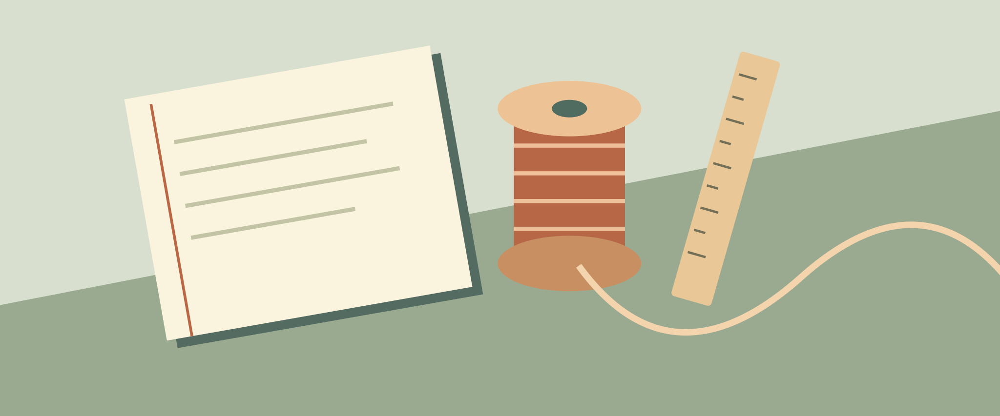

# 直して、また使う

特集二　文・図版：サンプル編集室

新しくする前に、もう一度眺めてみる。水庭の作業室で見つけたのは、道具を長く使うための、短い相談の時間だった。

## 小さな机を囲む

作業室の真ん中には、四人で囲める机がある。大きな機械も、特別な展示台もない。相談に来た人は、持ってきたものを布の上に置く。今日は背が外れかけた手帳と、縁の欠けた木箱が並んでいた。どちらも買い直すことはできる。それでも持ち主は、手に馴染んだ大きさを変えたくないのだと言った。

まず行うのは、直す場所を決めることではなく、まだ使える場所を確かめることだった。木箱の底は丈夫で、ふたもきれいに閉まる。手帳の紙には余白がたくさん残っている。困っている部分だけに目を向けると、道具全体が役に立たなくなったように感じてしまう。使える部分から話すと、次にすることが少し小さくなる。

## 途中を残す

壁の棚には、作業の途中のものが置かれている。紙の札には日付と、次に確かめたいことが一行ずつ書かれていた。担当した人が休みでも、別の人が続きを考えられるようにしているのだという。完成した姿だけでなく、迷っている理由も残す。その記録が、道具と人の間をつないでいる。

> [!tip] 引き継ぎの一行
> 「直らなかった」だけでは、次の人も同じところから始めることになる。試したことと、変わらなかったことを分けて書こう。分からない部分は、無理に結論を出さずに残してよい。

夕方、持ち主が木箱を受け取りに来た。欠けた縁には、元の木より少し明るい色の木片が入っている。その違いを隠さずに仕上げたのは、次に手入れするとき、どこを直したか分かるようにするためだった。箱を開け閉めする音は、来たときよりも小さくなっていた。

作業室の灯りが消える前に、机はもう一度空になる。明日ここへ来るものの形は、まだ分からない。だから空いた場所を残しておく。直して使うという営みは、過去を大切にするだけでなく、次の使い方のために余地をつくることでもあるのだろう。
