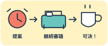

# スヌーズは会議である

　朝七時、スマートフォンが鳴った。私は止めた。七時五分、また鳴った。私はまた止めた。このやりとりを三回続けて、ようやく気づく。これは目覚ましではない。起床時刻を決める会議だ。

## 五分後の私ならできる

　昨夜の私は、朝の私をずいぶん高く評価していた。七時に起き、ストレッチをし、コーヒーをいれてから読書。予定表だけ見ると、生活について取材を受けられそうである。現場には、布団から右手だけを出して交渉している人がいる。

　スヌーズの五分は不思議だ。電車を待つ五分はあんなに長いのに、布団の中では予告編も終わらない。さっき閉じたばかりのまぶたに、もう次の議題が届く。

> 起床については、五分後の私に判断を委ねる。

　責任の所在が明確な、よくできた文章である。ただし委ねられた側も私だ。引き継ぎ資料はなく、引き継ぐ気もない。[^minutes]

### 朝の議事録

- 七時。起床案を提出。布団側の反対により継続審議。
- 七時五分。部屋の寒さについて新たな懸念が示される。
- 七時十分。コーヒーを条件に、起床案を可決。

　ようやく立ち上がると、猫が私の枕に移動してきた。引き継ぎが早い。私より職務への理解が深い。

> [!warning] 翌朝の自分へ
> 昨夜のやる気を、当てにしないこと。あの人はもう寝ました。

## コーヒーで採決する

　台所で湯を沸かしているあいだ、窓を開ける。外は、こちらの｜逡巡《しゅんじゅん》など知らない顔で朝になっている。向かいの家では洗濯物がすでに一列に並んでいた。あちらの会議は定刻に終わったらしい。

　コーヒーの匂いがすると、急に今日と話し合える気がしてくる。運動も読書もできなかったが、お湯は沸かせた。《《まずは一勝》》。採点基準を動かせるところが、自分で運営する生活のよさだ。

> [!quote] 本日の決議
> お湯を沸かした。それだけで、昨日の水より前進している。

　マグカップを持って机に座る。予定表の「朝の読書」を「コーヒー」に書き換えた。達成率が上がる。猫はまだ枕で寝ている。あちらは目標を変更せずに達成しているので、やはり一枚上手だ。

[^minutes]: 議事録は筆者の記憶による。出席者が半分寝ていたため、正確さには限界がある。
