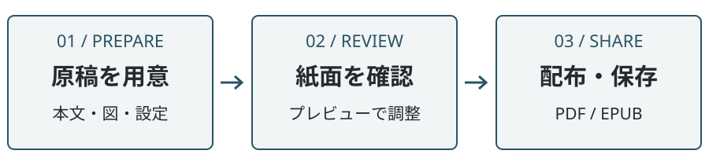

# 原稿を準備する

会議資料や小さな操作ガイドを、読み返せる一冊にまとめます。最初は短い原稿を二つ用意し、ページの流れを確認してから内容を増やします。

## 作業の流れ

<figure id="fig-flow">

<figcaption>原稿から配布までの三段階</figcaption>
</figure>

<a href="#fig-flow" data-ref="fig"></a>の順番で作業します。原稿と設定を分けておくと、本文を変えずに判型や書体を試せます。

## フォルダを作る

1. Vaultの中に、資料用のフォルダを作ります。
2. フォルダ内に `01-introduction.md` と `02-operation.md` を作り、それぞれに見出しと本文を書きます。
3. `index.md` にノートへのリンクを並べます。

   ```markdown
   # 原稿の順番

   1. [[01-introduction|はじめに]]
   2. [[02-operation|操作方法]]
   ```

4. 同じフォルダに `vivlio.yaml` を置きます。次章の設定例を使えます。
5. `vivlio.yaml` を右クリックし、Vivlioのプレビューを開きます。

> [!tip] ヒント：まず短い本文で確認する
> 最初からすべての図を入れず、見出しと数段落でページを確認します。原稿順と書字方向が合ってから、表や図を追加すると原因を切り分けやすくなります。

## 編集するときの約束

見出しには作業の名前を書き、本文には操作とその結果を書きます。「設定について」より「紙面を整える」のような見出しのほうが、目的の箇所を探しやすくなります。

- 一つの手順には、一つの主要な操作を書きます。
- 条件がある操作では、条件を先に示します。
  - 初めて作る資料なら、用紙と書字方向から決めます。
  - 既存資料の修正なら、現在の設定を確認してから変更します。
- キー名は <kbd>Enter</kbd>、組み合わせは <kbd>Ctrl</kbd> + <kbd>S</kbd> のように示します。

> [!warning] 注意：原稿のコピーを残す
> 配布済みの資料を更新するときは、原稿と設定の組を保存してください。PDFだけでは、後から同じ条件で編集し直せません。
