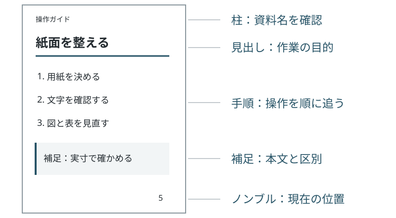

# 紙面を整える

前章の<a href="01-start.md#fig-flow" data-ref="fig"></a>の中央に当たる工程です。用紙を決めてから、文字の大きさ、図、表の順に確認します。

## 最小限の設定

次の例はA5・横書きのマニュアル用です。文字数・行数のグリッドを指定せず、余白から本文の領域を決めます。

```yaml
title: はじめての操作ガイド
theme: manual
writingMode: horizontal-tb
size: A5
columns: 1
charsPerLine: null
linesPerPage: null
baseFontSize: 10pt
paragraphIndent: 0
```

<table id="tbl-settings">
<caption>最初に見直す設定</caption>
<thead><tr><th>設定名</th><th>指定例</th><th>用途</th></tr></thead>
<tbody>
<tr><td><code>size</code></td><td>A5</td><td>配布する用紙の大きさ。</td></tr>
<tr><td><code>baseFontSize</code></td><td>10pt</td><td>本文の文字サイズ。</td></tr>
<tr><td><code>paragraphIndent</code></td><td>0</td><td>段落冒頭の字下げ。文章中心の資料では1emも選べます。</td></tr>
<tr><td><code>pageNumbering</code></td><td><code>roman-then-arabic</code></td><td>前付けをローマ数字、本文を算用数字にします。</td></tr>
<tr><td><code>monospaceFontFamily</code></td><td>Consolas</td><td>コードや設定値に使う等幅書体。</td></tr>
<tr><td><code>tocDepth</code></td><td>2</td><td>目次に含める見出しの深さ。</td></tr>
</tbody></table>

<a href="#tbl-settings" data-ref="tbl"></a>の項目を一つずつ変えて、結果を見比べます。複数の値を同時に変えると、どの変更が効いたか分かりにくくなります。

## 図を説明の近くに置く

1. 読者が確認する場所を、先に本文で説明します。
2. 図を置き、短いキャプションを付けます。
3. 図の文字を、完成時の用紙サイズで読めるか確認します。

<figure id="fig-page">

<figcaption>紙面の確認箇所（模式図）</figcaption>
</figure>

<a href="#fig-page" data-ref="fig"></a>では、本文だけでなく柱とページ番号も確認します。図は掲載位置に残るので、説明と一緒に読めます。

> [!note] 補足：長いコードの折り返し
> コードは紙面幅で折り返します。見た目の折り返しは、原稿に改行を挿入するものではありません。実行するコードは原稿からコピーしてください。

```text
資料の保管先の例：archive/project-handbooks/2026/autumn/reviewed/operations/installation-and-configuration/approved-manual-source.md
コード例の末尾：END-OF-CODE
```
