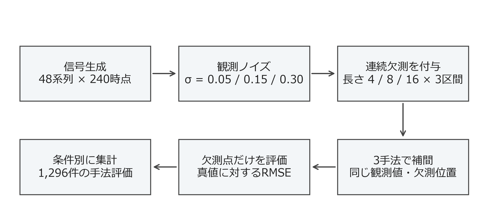

# 方法

## 信号と観測値の生成

時点を t = 0, …, 239 とし、系列 i のノイズのない信号を次式で定義した。信号値と振幅は無次元とし、時点間隔は1で固定した。

$$
f_i(t)=A_i\sin\left(\frac{2\pi t}{48}+\phi_i\right)+0.35\sin\left(\frac{2\pi t}{17}\right)+0.002t.
$$

振幅 A は区間［0.8, 1.2］、位相 φ は［0, 2π］からそれぞれ一様乱数で生成した。短周期成分には位相変動を加えず、長周期成分との重なり方だけを系列間で変化させた。観測値は y(t) = f(t) + σε(t) とし、εを独立な標準正規乱数とした。σは0.05、0.15、0.30の三水準で、0.15を主解析として事前に選んだ。

<figure class="tbl" id="tbl-design">
<figcaption>数値実験の条件と固定した設定</figcaption>
<table><thead><tr><th>項目</th><th>設定値</th><th>設定の目的</th></tr></thead><tbody>
<tr><td>系列数</td><td>48</td><td>位相・振幅・欠測位置の変動を含める</td></tr>
<tr><td>系列長</td><td>240時点</td><td>長周期成分を5周期含める</td></tr>
<tr><td>周期</td><td>48、17時点</td><td>異なる曲率を持つ区間を作る</td></tr>
<tr><td>振幅</td><td>A ∈ [0.8, 1.2]、短周期0.35</td><td>系列ごとの大きさを変える</td></tr>
<tr><td>ノイズ標準偏差</td><td>0.05、0.15、0.30</td><td>観測ノイズに対する感度分析</td></tr>
<tr><td>欠測長 L</td><td>4、8、16時点</td><td>連続して失われる区間の長さを変える</td></tr>
<tr><td>欠測区間数</td><td>各系列3区間</td><td>欠測位置の違いを系列内にも含める</td></tr>
<tr><td>乱数生成器</td><td>PCG64、基準種20260922</td><td>同じ条件を再計算できるようにする</td></tr>
</tbody></table>

各ノイズ水準・欠測長・手法について48系列を評価した。観測ノイズの標準偏差と系列間RMSEの標準偏差は異なる量である。

</figure>

乱数種は基準種に0始まりの系列番号を加えた値とした。同じ系列ではノイズ水準と欠測長を変えるたびに生成器を初期化し、位相・振幅・標準正規乱数・欠測開始位置を共通にした。したがって条件間の差は、独立に生成した系列同士の差ではなく、同じ基礎信号に加える処理の差として比較できる。乱数列の厳密な再現には、生成器だけでなくライブラリの版と呼び出し順も関係するため、版情報を保存した［2］。

## 欠測区間の設定

欠測開始位置は32、104、176を中心とし、それぞれに−8から8までの整数乱数を加えた。開始位置からL時点を欠測させたため、各系列の欠測点数は12、24、48となり、欠測率は5%、10%、20%である。区間同士が重ならず、すべての区間で前後の観測値が残るように設計した。端点の外挿は本実験に含めない。

<figure class="fig" id="fig-design">

<figcaption>実験の処理順序と評価件数。条件ごとに新しい系列を独立生成するのではなく、同じ系列の信号と乱数を共有して比較する。</figcaption>
</figure>

に処理の全体像を示す。欠測長を増やすと欠測率も同時に増える点に注意が必要である。このため本稿の結果は、欠測率を一定に保ったまま区間だけを長くする実験とは区別する。局所形状への依存を観察する目的で、欠測開始位置を周期の同じ位相に固定しなかった[^missing]。

## 補間法と評価指標

線形補間はNumPyの `interp` を用いた。同関数は順序づけられた観測座標に対する区分線形補間を返す［1］。最近傍補間では左右の観測点までの距離を比較し、同距離の場合には左側を選択した。直前値保持は、対象時点より前に存在する最も近い観測値を用いた。

<figure class="tbl" id="tbl-methods">
<figcaption>比較手法が使用する情報</figcaption>
<table><thead><tr><th>手法</th><th>補完値</th><th>将来側の観測</th><th>区間内の形状</th></tr></thead><tbody>
<tr><td>直前値保持</td><td>左端の観測値</td><td>不要</td><td>一定</td></tr>
<tr><td>最近傍補間</td><td>最も近い観測値</td><td>使用</td><td>左右で切り替わる段階状</td></tr>
<tr><td>線形補間</td><td>両端の距離加重平均</td><td>使用</td><td>直線</td></tr>
</tbody></table>

いずれの手法も欠測点の真値を入力として使用しない。真値は評価にのみ使用する。

</figure>

欠測点集合を M、推定値を f̂ とすると、主要指標は次式である。系列ごとに計算した後、48系列を等しい重みで集計した。

$$
\mathrm{RMSE}_i=\sqrt{\frac{1}{|M_i|}\sum_{t\in M_i}\left(\hat f_i(t)-f_i(t)\right)^2}.
$$

補助指標として絶対誤差の平均（MAE）と符号付き誤差の平均（bias）もCSVへ保存した。本文の主要表はRMSEの平均、標準偏差、中央値、90%点を示す。平均RMSEは、全系列の二乗誤差をまとめて平方根を取った量とは一致しない。欠測点数は同じ条件内では全系列で等しいが、計算順序による違いは残る。

欠測長16、σ = 0.15における線形補間と最近傍補間の差は、系列ごとのRMSE差を先に求めてから平均した。区間推定には48個の差を復元抽出する2,000回のブートストラップを用い、平均差の2.5%点と97.5%点を採用した。図中の誤差棒は別の量であり、系列間標準偏差を表す。

[^missing]: 欠測の発生確率を信号値に依存させる仕組みは導入していない。信号のピークだけが失われるような欠測機構は対象外である。
