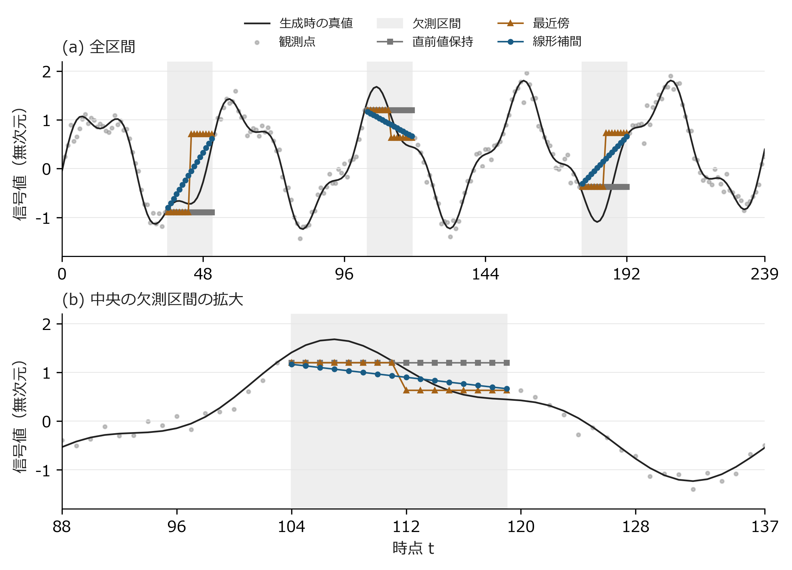
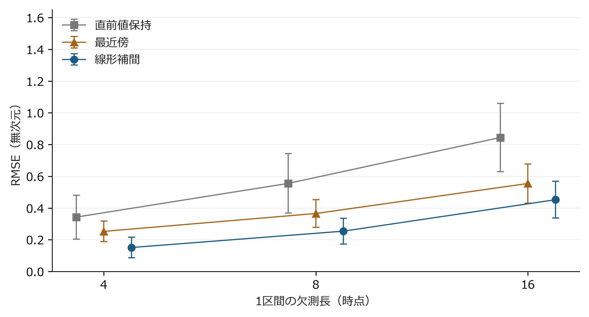
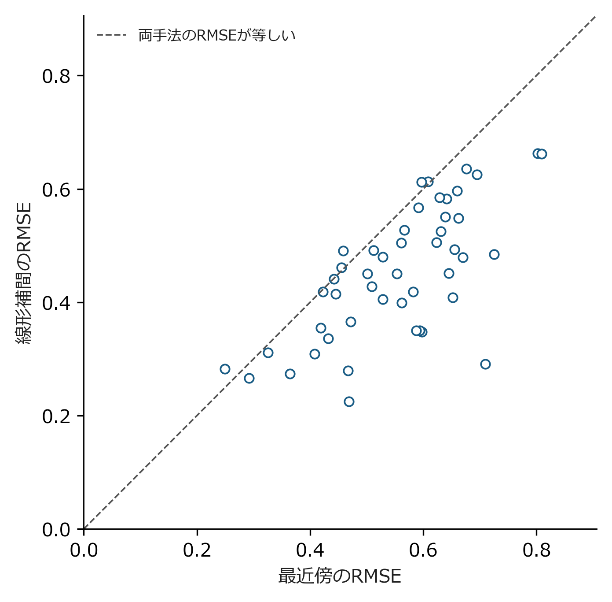
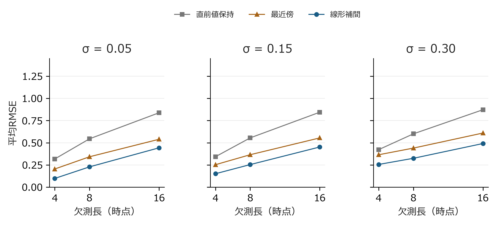

# 結果

## 主解析

σ = 0.15における集計をに示す。平均RMSEはすべての欠測長で線形補間、最近傍補間、直前値保持の順で小さかった。線形補間の平均RMSEは、欠測長4の0.151から欠測長16の0.452へ増加した。最近傍補間では0.253から0.555、直前値保持では0.343から0.844へ増加した。

<!-- generated:main -->
<figure class="tbl" id="tbl-main">
<figcaption>主解析における補間誤差（σ = 0.15）</figcaption>
<table><thead><tr><th>欠測長</th><th>手法</th><th>平均RMSE</th><th>標準偏差</th><th>中央値</th><th>90%点</th></tr></thead>
<tbody>
<tr><td>4</td><td>直前値保持</td><td>0.343</td><td>0.138</td><td>0.338</td><td>0.529</td></tr>
<tr><td>4</td><td>最近傍</td><td>0.253</td><td>0.064</td><td>0.260</td><td>0.330</td></tr>
<tr><td>4</td><td>線形補間</td><td>0.151</td><td>0.064</td><td>0.137</td><td>0.219</td></tr>
<tr><td>8</td><td>直前値保持</td><td>0.555</td><td>0.187</td><td>0.545</td><td>0.761</td></tr>
<tr><td>8</td><td>最近傍</td><td>0.366</td><td>0.087</td><td>0.367</td><td>0.465</td></tr>
<tr><td>8</td><td>線形補間</td><td>0.254</td><td>0.081</td><td>0.238</td><td>0.360</td></tr>
<tr><td>16</td><td>直前値保持</td><td>0.844</td><td>0.215</td><td>0.823</td><td>1.092</td></tr>
<tr><td>16</td><td>最近傍</td><td>0.555</td><td>0.123</td><td>0.574</td><td>0.682</td></tr>
<tr><td>16</td><td>線形補間</td><td>0.452</td><td>0.116</td><td>0.451</td><td>0.613</td></tr>
</tbody></table>

各条件48系列。標準偏差は系列間のばらつき。90%点は系列別RMSEの分位点であり、信頼区間の上限ではない。

</figure>
<!-- /generated:main -->

中央値も平均値と同じ手法順位であったが、系列ごとの誤差の分布には幅があった。たとえば欠測長16の線形補間では標準偏差が0.116、90%点が0.613である。平均値だけを見て「どの系列でも0.452程度の誤差になる」と解釈することはできない。欠測区間に含まれる波形の曲率や、観測ノイズの符号が系列ごとに異なることが、このばらつきの背景にある。

## 個別系列での補間形状

は系列S01の全区間と中央の欠測区間の拡大図である。黒線は生成時の真値、灰色の点は残された観測値、背景の薄い灰色は欠測区間を表す。補間線は欠測した時点だけに描き、観測点を含む全区間で予測しているようには見せていない。

<figure class="fig" id="fig-series">

<figcaption>系列S01の補間結果（L = 16、σ = 0.15）。(a) 全240時点、(b) 時点88〜137の拡大。系列は図の見栄えによって選ばず、最初の系列に固定した。</figcaption>
</figure>

直前値保持では区間内で推定値が変化しない。最近傍補間では区間の中ほどで採用する端点が切り替わる。線形補間は両端を結ぶため段差が小さい一方、区間内部の極値や短周期成分を再現することはできない。この図は平均誤差の順位を説明する補助であり、一例だけから手法全体の優劣を判断する根拠ではない。

## 欠測長と系列間変動

に平均RMSEと系列間標準偏差を示す。横軸は区間数ではなく一つの欠測区間の長さである。区間数はすべて3で固定した。欠測長が増えるにつれて三手法とも平均誤差が増え、直前値保持では系列間のばらつきも大きくなった。

<figure class="fig" id="fig-length">

<figcaption>欠測長と補間誤差の関係（σ = 0.15）。点は48系列の平均、誤差棒は±1標準偏差。線は条件を見分けるための接続であり、未評価の欠測長の測定値を示さない。</figcaption>
</figure>

誤差棒の重なりを統計的な差の検定として扱ってはいない。三手法は同じ系列に適用されているため、比較には系列内の対応を保つ必要がある。そこで欠測長16について、最近傍補間と線形補間のRMSEを同じ点の座標として示した。

<figure class="fig" id="fig-paired">

<figcaption>同一系列に対するRMSEの対応（L = 16、σ = 0.15）。1点は1系列、破線より下側では線形補間の誤差が小さい。両軸は同じ範囲・縮尺である。</figcaption>
</figure>

線形補間のRMSEが最近傍補間より小さい系列は48系列中43系列であった。平均差（線形−最近傍）は−0.102、95%パーセンタイル区間は［−0.129, −0.077］となった。この区間は合成系列を再標本化した結果であり、実測対象から抽出した標本の母集団推定ではない。各点の数値は[[06-appendix#系列別の主解析結果|付録の系列別結果]]に掲載した。

## 観測ノイズの感度分析

観測ノイズの標準偏差を0.05および0.30へ変更しても、評価した欠測長の範囲では平均RMSEの手法順位は変わらなかった。条件別の曲線を、欠測長16の数値をに示す。各パネルの縦軸範囲を共通にし、パネル間で誤差の大きさを比較できるようにした。

<figure class="fig" id="fig-noise">

<figcaption>ノイズ水準別の平均RMSE。各点は48系列の平均であり、パネルごとに異なる系列を作り直したものではない。線種の代わりに色と点の形を併用した。</figcaption>
</figure>

<!-- generated:noise -->
<figure class="tbl" id="tbl-noise">
<figcaption>観測ノイズに対する感度分析（欠測長16）</figcaption>
<table><thead><tr><th>σ</th><th>直前値保持</th><th>最近傍</th><th>線形補間</th></tr></thead>
<tbody>
<tr><td>0.05</td><td>0.838</td><td>0.539</td><td>0.443</td></tr>
<tr><td>0.15</td><td>0.844</td><td>0.555</td><td>0.452</td></tr>
<tr><td>0.30</td><td>0.872</td><td>0.610</td><td>0.492</td></tr>
</tbody></table>

値は48系列の平均RMSE。信号と欠測位置は条件間で共通とし、同一の標準正規乱数にσを掛けた。

</figure>
<!-- /generated:noise -->

ノイズを増やした際の変化には、端点の観測誤差が補間区間へ伝わる影響が含まれる。一方、長い区間で失われる曲線形状の誤差は、ノイズを小さくするだけでは解消しない。したがって観測精度の改善と欠測区間の短縮は、同じ操作として扱えない。これらの要因を厳密に分解するには、周期と欠測位置をさらに制御した実験が必要である。
